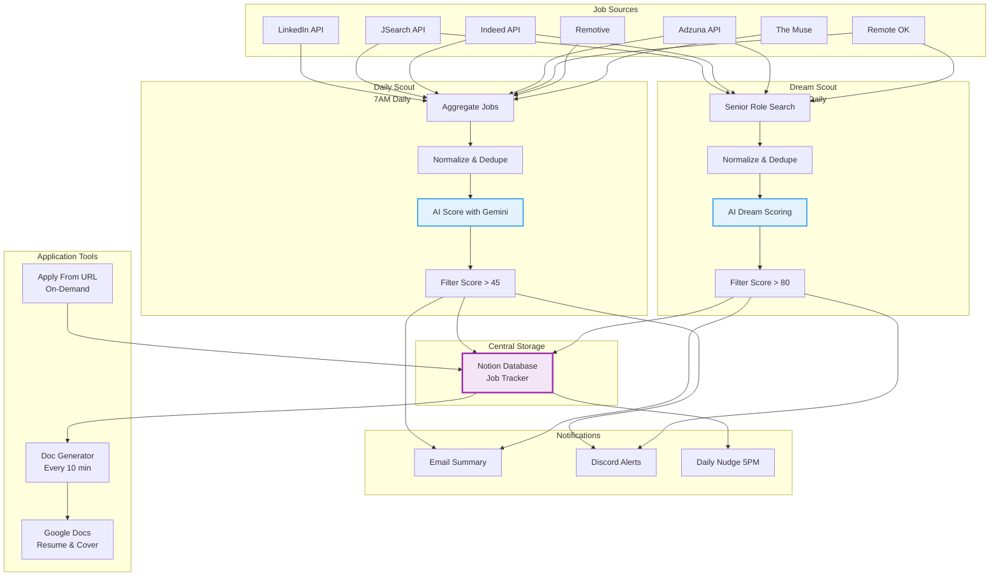
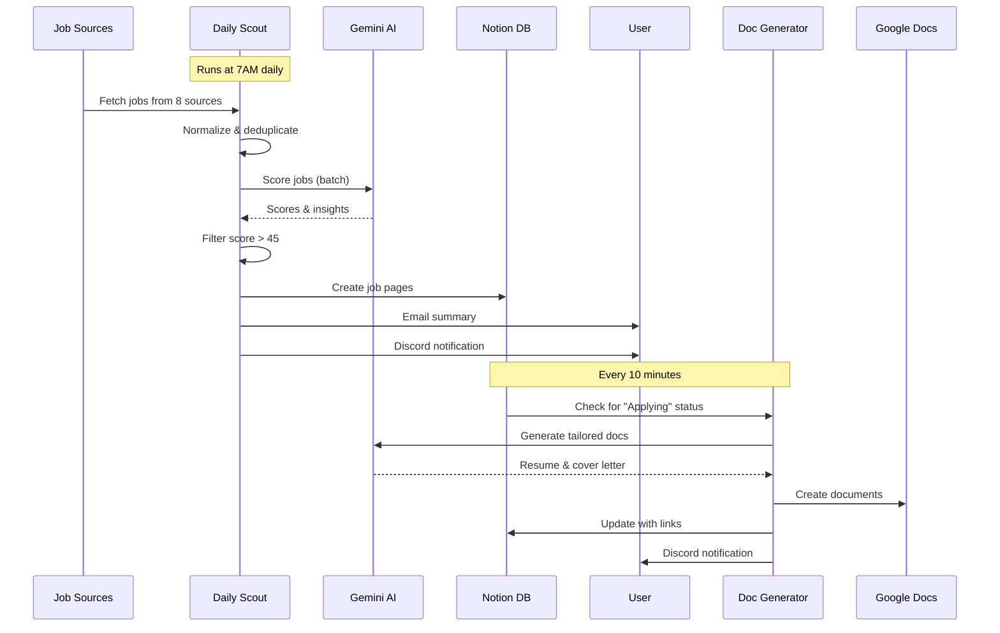
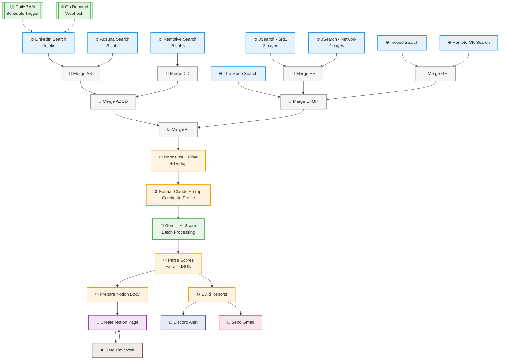
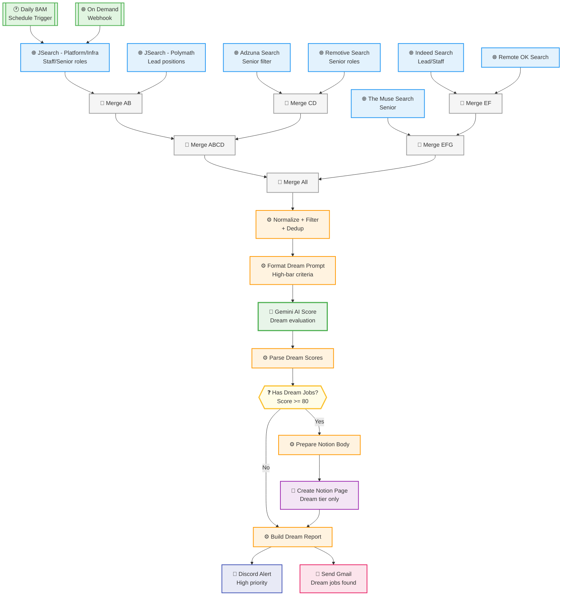
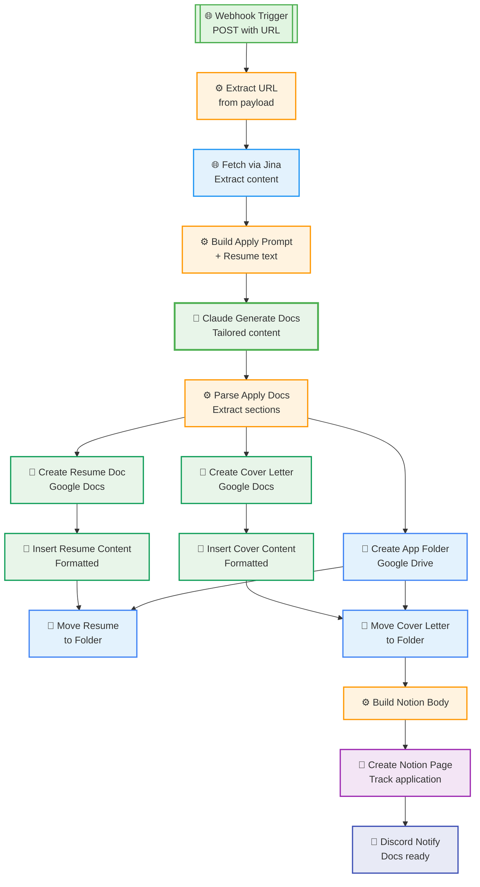
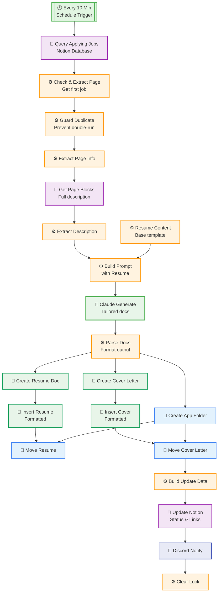
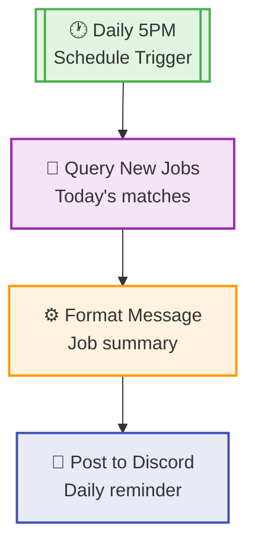
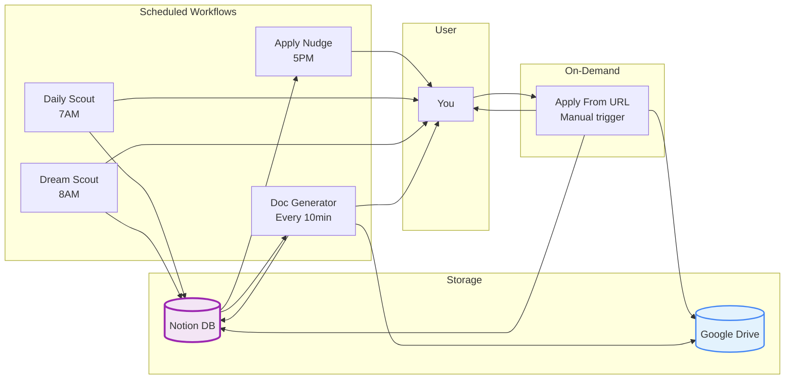

# Workflow Diagrams

Visual representations of each n8n workflow in the Job Scout suite.

## System Overview

## Data Flow

---

# Individual Workflow Details

## Job Search - Daily Scout

## Job Search - Dream Scout

## Job Apply From URL

## Job Application Doc Generator

## Job Scout - Apply Nudge

## Workflow Interactions

